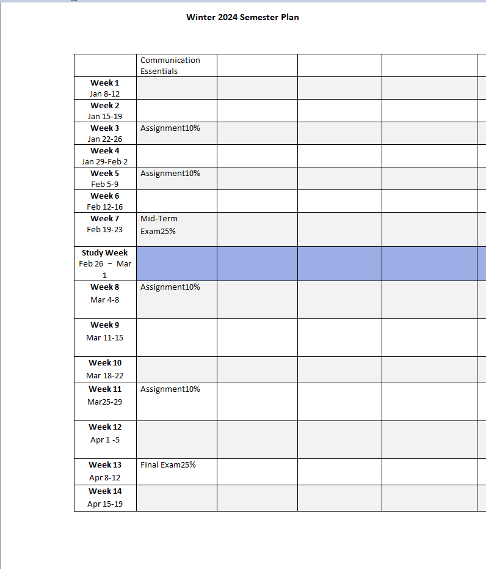

# Syllabus-Analysis

## Introduction

Welcome to the Syllabus-Analysis project! This program is designed to analyze Microsoft Word syllabus files and generate weekly schedules for students. It aims to simplify the process of organizing syllabus information into actionable plans.

## Features

- **File Analysis:** Analyze Microsoft Word syllabus files.
- **Weekly Schedule Generation:** Generate weekly schedules for students based on syllabus information.
- **Keyword Extraction:** Extract relevant keywords from syllabus content to facilitate analysis.
- **Duplicate Removal:** Remove duplicate entries to ensure data integrity.
- **Table Insertion:** Insert generated schedules into a Word document for easy viewing and sharing.

## Requirements

- Python 3.12
- tkinter
- python-docx
- comtypes
- pdf2docx

## Usage

1. Clone the repository to your local machine.
2. Ensure you have Python installed.
3. Install the required dependencies using pip:
    ```
    pip install tk python-docx comtypes pdf2docx
    ```
4. Run the program:
    ```
    python main.py
    ```
5. Click the button to select the Word file for analysis.
6. View the generated weekly schedules.

## Example



## Contributors

- [Chun-Wei Wang](https://github.com/WilsonCruzz)
- [Sebastian Bruce](https://github.com/SebastianBruce)
